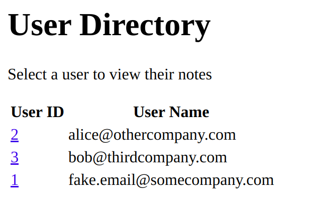
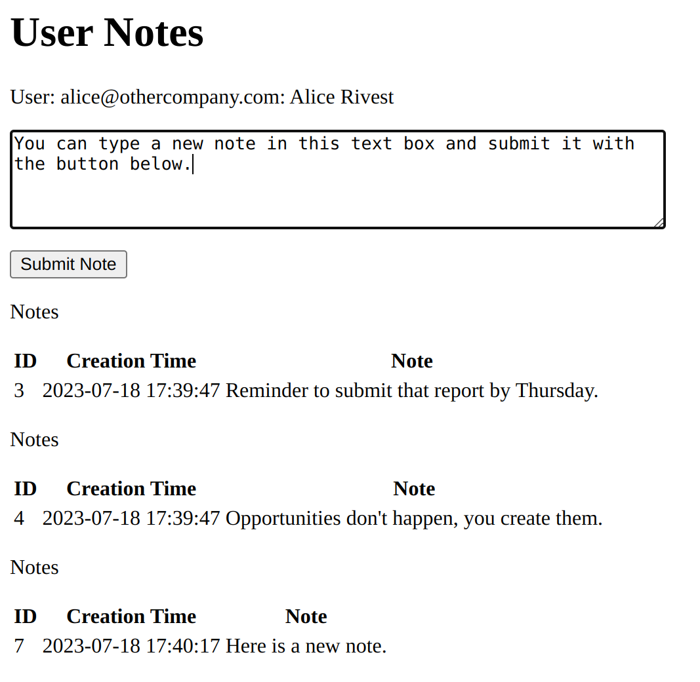
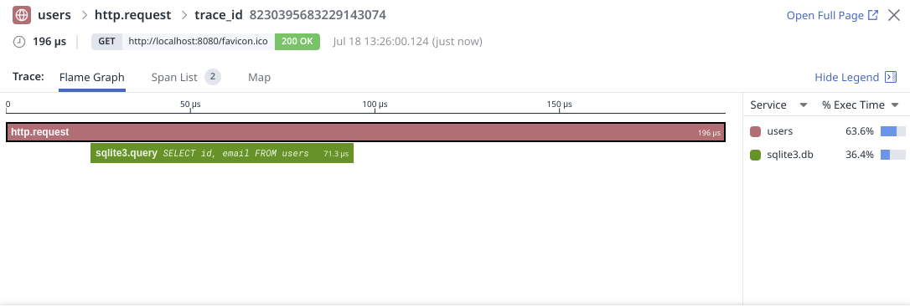
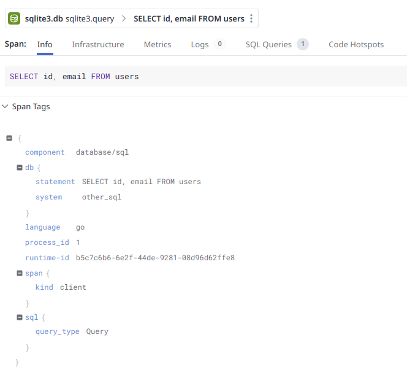
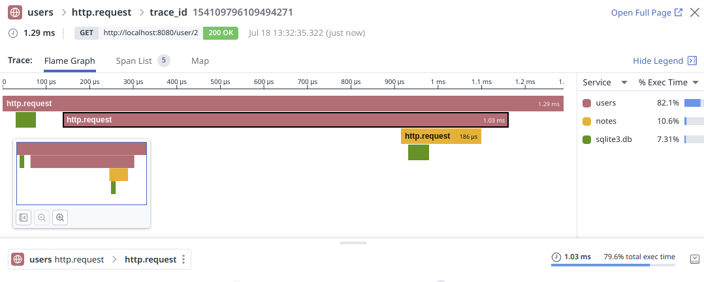
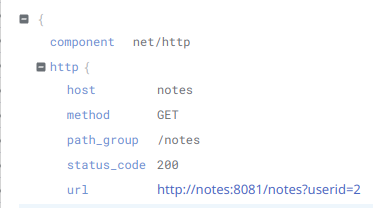
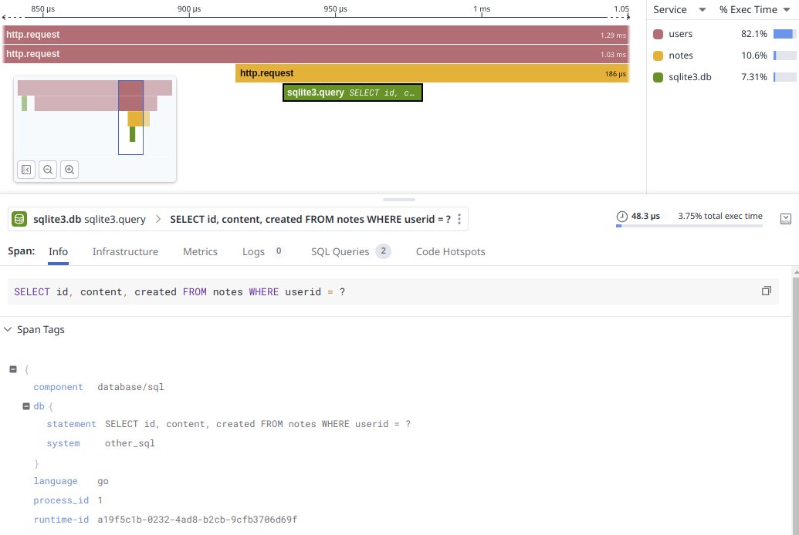
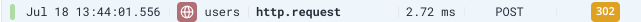
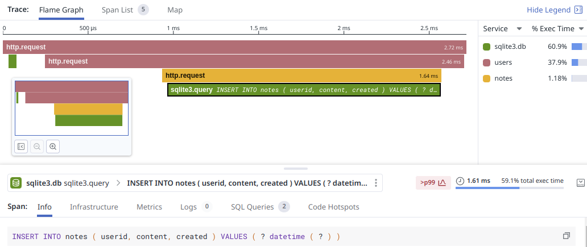

# go-sample-app
A sample application composed of several services, written in Go.

This application is a downloadable, interactive example that demonstrates how to use [Orchestrion][1] to auto-instrument Go applications for Datadog.

The application is a basic multi-user notes app that allows users to submit and read notes.

## Setup

### Prerequisites

Before getting started, ensure you have the following:
- [Docker Compose][2]
- A Datadog account and [API key][3]

Export a variable called `DD_API_KEY` in your shell environment:

```shell
$ export DD_API_KEY=<Your API Key>
```

The Datadog agent uses this key to submit traces.

If you want, you can have your traces set to a custom `env` (environment) so that they can be queried specifically:

```shell 
$ export DD_ENV=my.name
```

### Installing and running the sample app

1. To get started, clone the go-sample-app repo:
```shell
git clone https://github.com/DataDog/go-sample-app.git
```
2. Run the application from the `go-sample-app/` folder:
```shell
cd go-sample-app
docker-compose build
docker-compose up -d
```
3. Go to `localhost:8080` and verify the application is running.

You should see a simple web application with a basic UI. This tutorial uses this application to demonstrate how to use Orchestrion.

By default, the applications bind to `localhost:8080` and `localhost:8081`, so make sure those ports are not occupied by other services on your machine.

If you cannot free up those ports, you can modify the `docker-compose.yml` file in the root directory of this project, changing the port bindings in the `ports:` section.

For example, to move `users` service from `8080` to `8083`:
```diff
  users:
    container_name: users
    build: ./services/users
    ports:
-     - "8080:8080"
+     - "8083:8080"
```
Note: The rest of this tutorial assumes you're on the default ports.

### Exploring the sample app

1. Go to [`http://localhost:8080`][4] in your browser, you should see the application's main page. This is served by the `user` service in the `services/user` directory.

It is a simple directory of the imaginary users of our notes application.


2. Click a user's ID to go to their **Notes** page. Here, you can read and add notes.


3. Try adding a note or two.

These notes are read from and saved to the `notes` service in the `services/notes` directory.

Take a some time to look at the applications in [services/users/main.go](services/users/main.go) and [services/notes/main.go](services/notes/main.go).


## Adding instrumentation
So far, you have only ran and explored the sample application, but there is still no instrumentation in it. This means no traces are created or sent to Datadog.

The goal is to gain visibility into our application and what it's doing via Datadog APM. This allows you to see traces of the requests that come into the system and analyze the flow and time taken to fulfill a request.

Orchestrion simplifies the process of instrumenting your Go applications.

1. Make sure you have Orchestrion installed:
```sh
$ go install github.com/datadog/orchestrion@latest
```

2. Run Orchestrion over the code base. This recursively goes through the directories, finding Go files and adding instrumentation code to them.
```sh
$ orchestrion -w .
Scanning Package /.../go-sample-app
overwriting /.../go-sample-app/services/notes/main.go:
overwriting /.../go-sample-app/services/users/main.go:
overwriting /.../go-sample-app/tools/header_check.go:
```

3. If you are curious about the changes orchestrion made, review the git diff:
```sh
$ git diff
...
```

You should see new function calls and wrappers placed around relevant code such as HTTP handler functions and SQL clients. You'll also see comments added, such as `//dd:startwrap`. These comments are used to identify instrumented code, so that Orchestrion can be run multiple times without duplicating instrumentation, and also so Orchestrion can remove instrumentation when instructed to with the `-rm` flag.

4. Shut down the services:
```
$ docker-compose down
```

5. You need to update the `go.mod` files before you can build the new code. The Orchestrion instrumentation requires code from the `github.com/DataDog/orchestrion` library:

```shell
$ cd services/users
$ go mod tidy
$ cd ../notes/
$ go mod tidy
$ cd ../../
```

6. Rebuild the applications with the newly instrumented code:
```shell
$ docker-compose build
```

7. And start the services again:

| :zap: Remember that the DD_API_KEY environment variable needs to be set! |
|--------------------------------------------------------------------------|

```shell
$ docker-compose up -d
```

Going to the application home page [http://localhost:8080][4] displays the same page, but if you look at the [Traces][5] page in the Datadog app, new traces should appear!



Click through the various spans and tabs. For instance, by clicking the `sqlite3.query` span, we can see the SQL query and other info.



## Generating more traces

You've added some basic instrumentation to the sample application, so you can now generate some more interesting traces.

1. From the sample application in your browser, click one of the users' IDs to go to their notes page.

Navigating to that page should generate another trace, which looks like this:


Here, you can see that the `users` service received an HTTP request. It then sent an outgoing HTTP request to the `notes` service, requesting `/notes?userid=2`. This varies depending on which user's page you view.



The `notes` service then executes a SQL query:


2. Add a new note. When you do, you should see a new trace appear.



This trace appears with type `POST` and status code `302` because the `users` service returns a redirect to the browser after the submission succeeds.

3. Examine the trace again. You can see that the `users` service communicates with the `notes` service, this time resulting in an `INSERT` query.


## Removing Instrumentation

Removing instrumentation is as simple as adding it. To remove the instrumentation added by Orchestrion:

1. Run the following in the repository root:
```shell
$ orchestrion -rm -w .
```

2. Run `go mod tidy` again, as you did before, for both services. This cleans up the dependencies from before.

3. Run `git diff` to verify you removed the instrumentation:
```sh
$ git diff
```
[1]: https://github.com/DataDog/orchestrion
[2]: https://docs.docker.com/compose/install/
[3]: https://docs.datadoghq.com/account_management/api-app-keys/
[4]: http://localhost:8080
[5]: https://app.datadoghq.com/apm/traces
